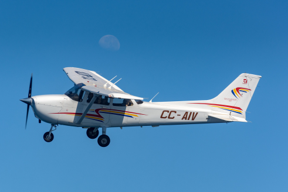

# QI Project : Study of the wing mass model for the CESSNA C172 Skyhawk aircraft
## Description : 

The Cessna C172 Skyhawk airplane, built by the American company Cessna since 1955, is the most popular tourism aircraft in the world according to its [Wikipedia page](https://en.wikipedia.org/wiki/Cessna_172) .
It has become a case study to illustrate the principles of aeronautical design. In particular, the model expressing the mass of the wing of this aircraft as a function of 10 influential parameters is part of the illustrative cases of the [OpenTURNS](https://openturns.github.io/openturns/latest/usecases/use_case_wingweight.html) platform.

>The objective of this project is to study the influence of the different parameters on the mass of the wing and to verify whether a simplification